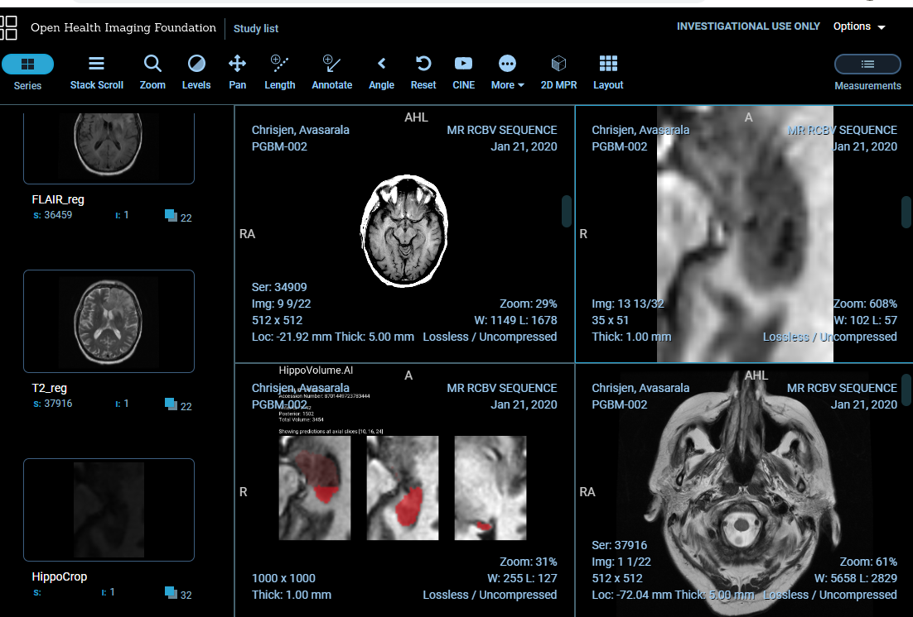

# Section 3: Integrating into a Clinical Network

A hippocampus segmentation report in OHIF viewer
In this final section you will use some of the work you did for Section 2 to create an AI product that can be integrated into a clinical network and provide the auto-computed information on the hippocampal volume to the clinicians. While hospital integrations are typically handled by hospital IT staff, it will help tremendously if you can talk the same language with the people who will operate your model, and will have a feel for how clinical radiological software works. These skills will also help you debug your model in the field.

You will perform this section in a different workspace than the previous two sections: Workspace for Section 3. This workspace is a simpler hardware, with no GPU, which is more representative of a clinical environment. This workspace also has a few tools installed in it, which is replicates the following clinical network setup:

Specifically, we have the following software in this setup:
* MRI scanner is represented by a script `section3/src/deploy_scripts/send_volume.sh`. When you run this script it will simulate what happens after a radiological exam is complete, and send a volume to the clinical PACS. Note that scanners typically send entire studies to archives. *PACS server is represented by [Orthanc](http://orthanc-server.com/) deployment that is listening to DICOM DIMSE requests on port 4242. Orthanc also has a DicomWeb interface that is exposed at port 8042, prefix /dicom-web. There is no authentication and you are welcome to explore either one of the mechanisms of access using a tool like curl or Postman. Our PACS server is also running an auto-routing module that sends a copy of everything it receives to an AI server. See instructions ad the end of this page on how to launch if you are using the Udacity Workspace.
* Viewer system is represented by OHIF. It is connecting to the Orthanc server using DicomWeb and is serving a web application on port 3000. Again, see instructions at the end of this page if you are using the Udacity Workspace.
* AI server is represented by a couple of scripts. `section3/src/deploy_scripts/start_listener.sh` brings up a DCMTK's `storescp` and configures it to just copy everything it receives into a directory that you will need to specify by editing this script, organizing studies as one folder per study. HippoVolume.AI is the AI module that you will create in this section.

As with Section 2, in the directory called `section3/src` you will find the source code that forms the skeleton of the HippoVolume.AI module.

`inference_dcm.py` is the file that you will be working on. It contains code that will analyze the directory of the AI server that contains the routed studies, find the right series to run your algorithm on, will generate report, and push it back to our PACS.

Note that in real system you would architect things a bit differently. Probably, AI server would be a separate piece of software that would monitor the output of the listener, and would manage multiple AI modules, deciding which one to run, automatically. In our case, for the sake of simplicity, all code sits in one Python script that you would have to run manually after you simulate an exam via the `send_volume.sh` script - `inference_dcm.py`. It combines the functions of processing of the listener output and executing the model, and it does not do any proper error handling :)

If you did everything correctly, an MRI scan will be sent to the PACS and to your module which will compute the volume, prepare the report and push it back to the PACS so that it could be inspected in our clinical viewer.

Note, that the DICOM studies used for inferencing this section have been created artificially, and while full-brain series belong to the same original study, this is not the study from which the hippocampus crop is taken.

Now that you have built a radiological AI system and given it to clinicians, you can start collecting data on how your model performs in the real world. If you (or the company you work for) intends to commercialize your technology, you will have to clear the regulatory bar. As we have discussed in our final lesson, an important contribution of an AI engineer to this endeavor is helping execute the clinical validation by contributing to a validation plan. Your final task in this course is to write a draft of such plan (shoot for 1-2 pages for this exercise). Remember - clinical validation is all about proving that your technology performs the way you claim it does. If you are saying that it can measure hippocampal volume, your validation needs prove that it actually does, and establish the extents to which your claim is true. Your validation plan needs to define how you would prove this, and establish these extents.

For the purpose of this exercise, assume that you have access to any clinical facility and patient cohorts you need, and that you have all the budget in the world. In your plan, touch on at least the following:
* Your algorithm relies upon certain "ground truth" - how did you define your ground truth? How will you prove that your method of collecting the ground truth is robust and represents the population that you claim this algorithm is good for?
* How do you define accuracy of your algorithm and how do you measure it with respect to real world population? Check out the [calculator and report from HippoFit](http://www.smanohar.com/biobank/calculator.html) for some inspiration.
* How do you define what data your algorithm can operate on?

There is no right answer here - think of these and other questions that would come up during validation of such algorithm. Thinking of such things early on will help you build better algorithms in the first place.

## Instructions

Once you complete this section, copy the following into directory `section3/out`:
* Code that runs inference on a DICOM volume and produces a DICOM report
* A report.dcm file with a sample report
* Screenshots of your report shown in the OHIF viewer
* 1-2 page Validation Plan

## Stand-out Suggestions

Optionally, look into the following to explore the subject deeper and make your project stand out. Put the deliverables in the output directory.

* Can you propose a better way of filtering a study for correct series?
* Can you think of what would make the report you generate from your inference better? What would be the relevant information that you could present which would help a clinician better reason about whether your model performed well or not?
* Try to construct a fully valid DICOM as your model output (per [DICOM PS3.3#A8](http://dicom.nema.org/medical/dicom/current/output/html/part03.html#sect_A.8)) with all relevant fields. Construction of valid DICOM has a very calming effect on the mind and body.
* Try constructing a DICOM image with your segmentation mask as a separate image series so that you can overlay it on the original image using the clinical image viewer and inspect the predicted volume better. Note that OHIF does not support overlaying - try using Slicer 3D or Radiant (Fusion feature). Include screenshots.

## Access Orthanc and OHIF

Before starting to work on the tasks in this workspace you should launch Orthanc and OHIF and here are the steps:

  1. Open a terminal and enter the following: `bash launch_orthanc.sh` or `./launch_orthanc.sh`. **Don't close this terminal.**
  2. Wait for it to complete, with the last line being something like `W0509 05:38:21.152402 main.cpp:719] Orthanc has started` and/or you can verify that Orthanc is working by running `echoscu 127.0.0.1 4242 -v` in a new terminal.
  3. Open a new terminal and enter the following `bash launch_OHIF.sh` or `./launch_OHIF.sh`. **Don't close this terminal.**
  4. Wait for it to complete, with the last line being something like `@ohif/viewer: ℹ ｢wdm｣: Compiled with warnings.`
  5. You will then want to enter the Desktop with the bottom right hand corner.
    * OHIF should automatically open in a Chromium Web Browser but if not you can paste `localhost:3005` into the address bar of a Chromium Window.
    * orthanc isn't necessary to open but if you need it you can access it can paste `localhost:8042` into the address bar of a Chromium Window.
